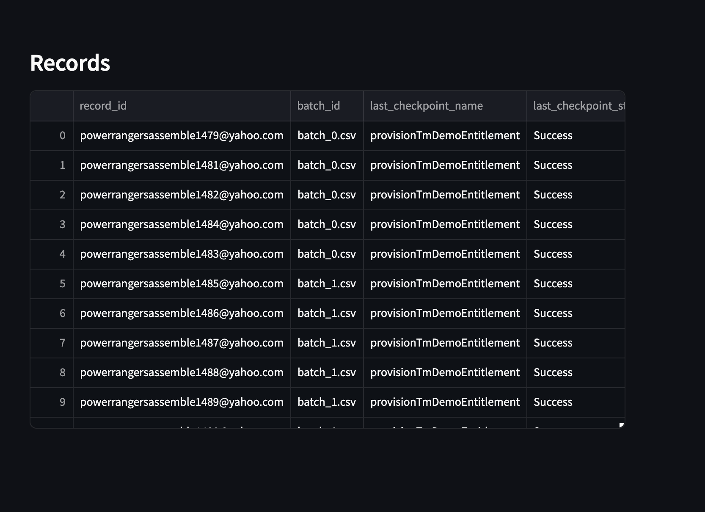

# Batch Runner

Developement Tool for running scripts in local machine.

## Features
* Batches Data Inputed according to the batch size specified in configuration.yaml
* If a record in a batch is not processed, or the execution fails, then the batch is updated with status "Failed" and can be retried.
* Error Logs are written in separate files
* Streamlit UI application to monitor the status of each records processed.

## Environment Setup
`python3` and `pip3` are recommended installs along with a minimum node version of 14.x (recommended - 20.x)

Make sure the following permissions are provided for the shell scripts -
chmod +x build.sh
chmod +x py_setup.sh

#### To Run Python Script in a virtual environment
chmod +x build.sh
chmod +x py_setup.sh

#### To Run the Script
npm i
./build.sh

## Concepts

Batch - a batch is group of records that are to be processed in parallel
Checkpoint - a checkpoint is the current stage of record processed.

## Streamlit UI

